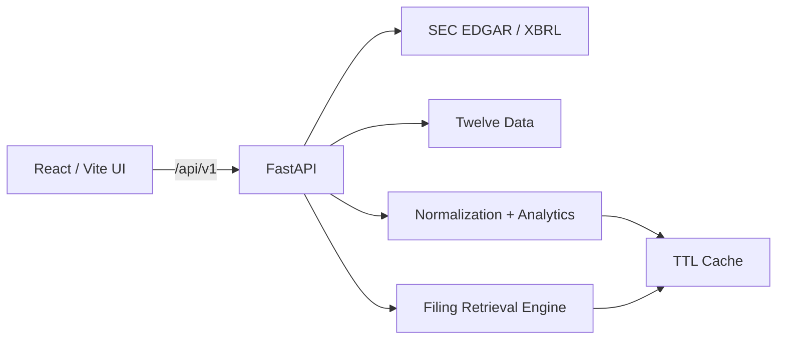

# FINENGINE // Company Intelligence OS

FINENGINE is a production-oriented financial research application that turns fragmented public-company data into one traceable workflow: **market telemetry → SEC-normalized fundamentals → peer comparison → filing evidence → transparent valuation scenarios**.

It is intentionally not a stock-picking app. There are no buy/sell labels. The product is designed to help a user understand *what the company reports, how the operating profile compares, what the filings actually say, and how valuation changes when assumptions change*.

## Why this exists

A basic finance dashboard is easy to build and weak as a portfolio project. FINENGINE solves a more credible problem: company research is fragmented across market-data sites, SEC filings, spreadsheets, and valuation templates. This project consolidates those steps while preserving data provenance and making the analytical assumptions inspectable.

## Core experiences

### 01 // Company Overview
- Search U.S. public companies using the SEC ticker registry
- Live/dynamic daily price history through Twelve Data
- Annualized volatility, selected-period return, price range, max drawdown
- SEC XBRL normalization for revenue, net income, operating income, cash, debt, equity, operating cash flow, capex and diluted shares
- Derived free cash flow, operating margin, net margin, ROA, ROE, debt/equity, P/S, P/E, P/FCF and net cash
- Deterministic operating diagnostics with no investment recommendation language
- Explicit data-provenance pipeline

### 02 // Peer Matrix
Compare up to five companies using the *same normalized definitions* rather than mixing numbers copied from different websites.

### 03 // Filing Lens
- Loads recent 10-K, 10-Q and 8-K metadata directly from SEC EDGAR
- Fetches the newest 10-K/10-Q document on demand
- Removes presentation noise and tables
- Ranks filing excerpts against a natural-language search query
- Returns the actual evidence passage and direct SEC filing link

This feature deliberately uses deterministic retrieval instead of inventing an AI answer. It is useful on its own and gives the project a strong information-retrieval story without becoming another LLM wrapper.

### 04 // Scenario Lab
A transparent discounted-cash-flow scenario engine based on:
- latest normalized annual SEC free cash flow
- cash
- debt
- diluted share count
- user-controlled growth, discount rate, terminal growth and forecast horizon

Every assumption stays visible. Output is labeled as a mathematical scenario, not a price target or investment recommendation.

## Architecture



### Backend
- Python 3.12
- FastAPI
- Pydantic Settings
- HTTPX async I/O
- SEC EDGAR JSON/XBRL APIs
- BeautifulSoup filing extraction
- process-local TTL cache behind an explicit service boundary
- deterministic analytics and DCF engine

### Frontend
- React + TypeScript + Vite
- Recharts
- Lucide icons
- custom responsive CSS
- local watchlist persistence

### Deployment
The production Docker image uses a multi-stage build:
1. Node builds the Vite client.
2. Python installs only the API/runtime dependencies.
3. The Vite `dist` folder is copied into FastAPI static assets.
4. One origin serves both the SPA and `/api`, avoiding production CORS complexity.

## Visual direction

The interface uses a cinematic infrastructure aesthetic instead of a generic SaaS dashboard:
- near-black `#07090b` base
- ice/cyan telemetry accents
- thin translucent architectural hairlines
- persistent left level rail
- oversized ticker typography
- mono system metadata
- restrained glow and scan-line atmosphere
- reduced-motion support
- responsive mobile rail

## Data choices

### SEC EDGAR — fundamentals and filings
SEC public APIs are the source of truth for company-reported facts. Automated access should identify the client with a meaningful `User-Agent` and respect SEC fair-access limits.

FINENGINE deliberately uses the latest **annual 10-K values for flow metrics** (revenue, earnings, operating cash flow, capex, diluted shares) so it does not silently mix quarter/YTD values with annual DCF inputs. Balance-sheet facts use the latest 10-K/10-Q point-in-time value.

### Twelve Data — market telemetry
Twelve Data supplies dynamic market-price history. FINENGINE still works in SEC-only mode without the key; market-dependent charts and valuation multiples remain unavailable until configured.

## Quick start — Windows

Prerequisites:
- Python 3.12+
- Node.js 22+

From the unzipped project root:

```powershell
.\START_WINDOWS.ps1
```

The script will:
- create `.venv`
- install Python dependencies
- create `apps/api/.env` from the example if needed
- install frontend dependencies
- start FastAPI on `http://127.0.0.1:8000`
- start Vite on `http://localhost:5173`

### Add your market-data key

Open:

```text
apps/api/.env
```

Set:

```env
TWELVE_DATA_API_KEY=YOUR_KEY
SEC_USER_AGENT=FinEngine/2.0 your-real-email@example.com
```

Restart the API after changing environment variables.

## Manual local start

### API

```powershell
py -3 -m venv .venv
.\.venv\Scripts\Activate.ps1
pip install -r apps/api/requirements.txt
copy apps\api\.env.example apps\api\.env
python -m uvicorn app.main:app --app-dir apps/api --reload --port 8000
```

### Web

In a second terminal:

```powershell
cd apps/web
npm install
npm run dev
```

## Validation

```powershell
# Python tests
.\.venv\Scripts\python.exe -m pytest -q

# React / TypeScript
npm run typecheck --prefix apps/web
npm run build --prefix apps/web
```

The GitHub Actions workflow runs the same checks on pushes and pull requests.

## Docker

```bash
docker build -t finengine .
docker run --rm -p 8000:8000 \
  -e TWELVE_DATA_API_KEY=YOUR_KEY \
  -e SEC_USER_AGENT="FinEngine/2.0 you@example.com" \
  finengine
```

Open `http://localhost:8000`.

## Render deployment

A `render.yaml` blueprint is included. Push the repository to GitHub, create a Render Blueprint, and configure the two secret environment variables:
- `TWELVE_DATA_API_KEY`
- `SEC_USER_AGENT`

Render can deploy the included Dockerfile directly. The health check is `/api/v1/health`.

## API surface

```text
GET  /api/v1/health
GET  /api/v1/search?q=apple
GET  /api/v1/company/AAPL/overview
GET  /api/v1/company/AAPL/filings
GET  /api/v1/company/AAPL/filing-search?q=supply%20chain
GET  /api/v1/compare?tickers=AAPL,MSFT,NVDA
POST /api/v1/company/AAPL/scenario/dcf
GET  /api/docs
```

## Example DCF request

```json
{
  "growth_rate": 5,
  "discount_rate": 10,
  "terminal_growth_rate": 2.5,
  "years": 5
}
```

## Important limitations

- SEC XBRL concepts vary across issuers. FINENGINE maps common GAAP concepts and exposes missing data rather than fabricating replacements.
- The DCF is intentionally simple and transparent. A professional model would include explicit revenue/margin drivers, taxes, working capital, SBC, lease treatment and scenario distributions.
- Free market-data plans have rate/entitlement limits. The service/cache boundary is intentionally designed so a paid provider or Redis can be substituted later.
- This project is an analytical/educational tool, not investment advice.

## Portfolio talking points

This project demonstrates more than API consumption:
- async service integration
- public financial-data normalization
- accounting-period consistency
- deterministic analytics
- information retrieval from long SEC filings
- traceable data provenance
- scenario modeling
- typed API/client contracts
- responsive product design
- Docker multi-stage deployment
- CI
- graceful degradation when a provider is not configured

## Next serious upgrades

The architecture supports these without rewriting the product:
- Postgres-backed saved research workspaces
- scheduled watchlist refresh workers
- earnings-event comparison
- TTM statement construction from quarterly XBRL frames
- sector/industry peer discovery
- portfolio exposure analysis
- Redis cache + background jobs
- optional filing-RAG/LLM layer where every answer cites retrieved SEC passages

